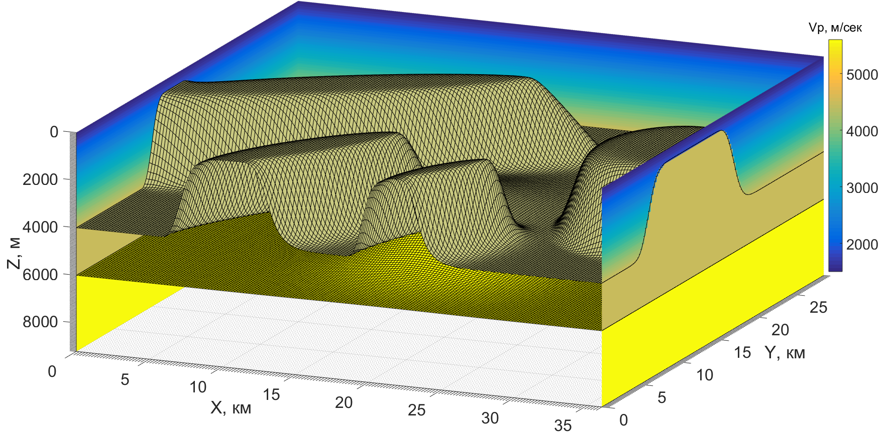

# 3D-Eikonal-microseismic-location
Matlab project for microseismic events hypocenter location in 3D medium with Eikonal equation.
I will add this project here as soon as possible.
Based on my MSc thesis.

